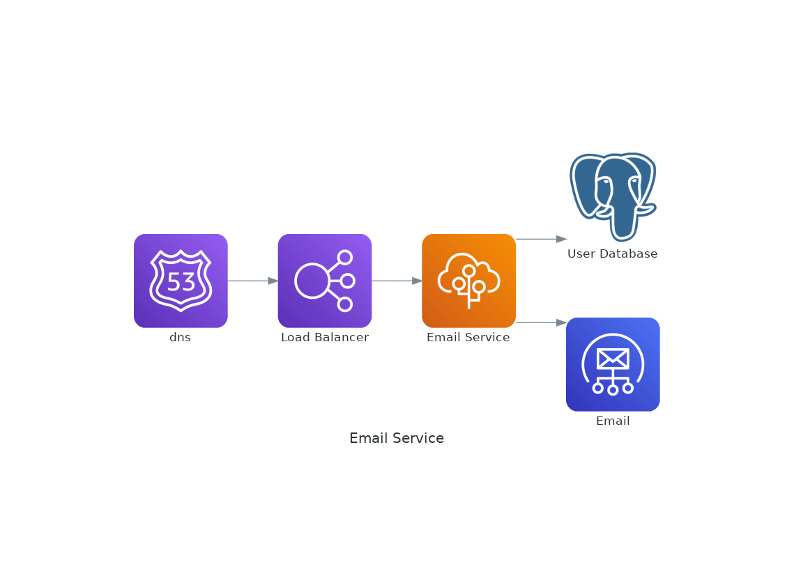
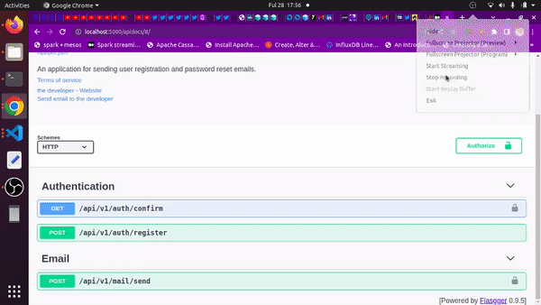

# email-service
> A service that send users emails such as account activation or password reset email.

<p align="center">
  
  
  
  
  
  
  
  
  
  
  
  
  
  
  
</p>



## Project Overview
This is a simple web application that makes the sending of email easier. It enables the uesr to send single or mutiple emails for use cases such as account confirmation, password rest as well for general communication. It is built with flask and deployed to AWS Beanstalk and uses AWS SES.

## Working 

To use it, you need a [user management system](https://github.com/twyle/user-management-service) that enables the user to register an account. The email used to register then can be used bythis application. The application also uses the same database as the user managment system to activate the user's account once they have clicked the confirmation link in their email. To use, you need an email provider such AWS SES:

 1. Submit your email address (post email through send route)
 2. Confirm your email address (paste the activation token through the confirm route).
 3. Your account is then activated.

 <p align=center>
  
</p>

 ## Features

This application has several features including:

1. Deployed to an AWS EBS.
2. Versioned using git and Hosted on GitHub.
3. Auto-deployed to AWS EBS using Github actions.
4. Uses gunicorn as the application servers.
5. Uses an Application Load Balancer to redirect traffic to the frontend
6. Uses AWS SES to send confirmation emails.

## Local Setup

Here is how to set up the application locally:

  1. Clone the application repo:</br>

      ```sh
      git clone https://github.com/twyle/email-service.git
      ```

  2. Navigate into the cloned repo:

      ```sh
      cd email-service
      ```

  3. Create a Virtual environment:

      ```sh
      python3 -m venv venv
      ```

  4. Activate the virtual environmnet:

      ```sh
      source venv/bin/activate
      ```

  5. Install the project dependancies:

      ```sh
      pip install --upgrade pip # update the package manager
      pip install -r requirements.txt  
      ```

  6. Create the environment variables for each service:

      ```sh
      touch .env
      ```

      Then paste the following into the file:

      ```sh

        FLASK_APP=manage.py
        FLASK_DEBUG=True
        FLASK_ENV=development

        POSTGRES_HOST=<YOUR_COMPUTER_IP_ADDRESS>
        POSTGRES_DB=lyle
        POSTGRES_PORT=5432
        POSTGRES_USER=postgres
        POSTGRES_PASSWORD=lyle

        MAIL_USERNAME=<mail-username>
        MAIL_PASSWORD=<mail-password>
        MAIL_SERVER=<mail-server>
        MAIL_PORT=465
        MAIL_USE_SSL=True

      ```

  7. Start the services:

      ```sh
      python manage.py run
      ```

  8. View the running application

      Head over to http://0.0.0.0:5000/apidocs 

## Development

 #### 1. Application Design

  1. **Services**

      The application consists of one service that send account activation emails to users:

      1. Email Service 

      
        
        This service is resposible for sending account activation emails. The routes include:

        | Route                   | Method  | Description                 |
        | ------------------------| ------- |---------------------------- |
        | 'api/v1/email/send'     | POST    | Send confirmation email.    |
        | 'api/v1/email/confirm'  | GET     | Activate account.           |
        
        1. Register as a new user with a unique email address and password as well as name.(Generates a uniques token) 
        2. Proceed to your email address and click on the link given within 24 hours to activate your account. (marks account as activated)
        3. Log into your account using your email and password. (You get a unique token for authorization)

        This service uses the Postgres Database to store the user info. It uses an SQS queue to schedule the sending of account activation emails, handled by the emailer Lambda function. It also writes logs to the sqs queue to be processed by the logging lambda function.

 #### 2. Project Management

   1. **Coding standards** </br>

      The application had to adhere to the following coding standards:
      1. Variable names
      2. Function names
      3. Test driven development
      4. Individual modules need 60% coverage and an overall coverage of 60%.
      5. CI/CD pipeline has to pass before deployments.
      6. Commit messages format has to be adhered to.
      7. Only push code to github using development branches.
      8. Releases have to be tagged.
      9. Use pre-commit to run code quality checks
      10. Use comitizen to format commit messages

   2. **Application development process management** </br>

      The project uses GitHub Projects for management.

 #### 3. Development Workflow

 The application uses atleast 5 branches:

  1. Features branch used to develop new features.
  2. Development branch used to hold the most upto date features that are yet to be deployed.
  3. Staging branch holds the code that is currently being tested for production.
  4. The release branch holds all the assets used when creating a release.
  5. The production branch holds the code for the currently deployed application.

The development workflow follows the following steps:

  1. A feature branch is created for the development of a new feature.
  2. The code is then pushed to GitHub, triggering the feature-development-workflow.yml workflow. If all the tests pass, the feature is reviewde and merged into the development branch.
  3. The code in the development branch is then deployed to the development environment. If the deployment is succesful, the development branch is merged into the staging branch.
  4. This triggers the staging workflow. If all the tests are succesful, this branch is reviewed and deployed to a staging environment.
  5. For creatinga release, the staging branch is merged into the release branch. This happens when a tag is pushed to GitHub.
  6. Once a release is created, the release branch is merged into the production branch, which is deployed into production.

The workflows require a couple of secrets to work:

      ```sh
        FLASK_APP=manage.py
        FLASK_ENV=development

        SECRET_KEY=supersecretkey

        POSTGRES_HOST=<YOUR-IP-ADDRESS>
        POSTGRES_DB=lyle
        POSTGRES_PORT=5432
        POSTGRES_USER=postgres
        POSTGRES_PASSWORD=lyle

        MAIL_USERNAME=<mail-username>
        MAIL_PASSWORD=<mail-password>
        MAIL_SERVER=<mail-server>
        MAIL_PORT=465
        MAIL_USE_SSL=True

      ```

The workflows also require the followingenvironments to work:

  1. Test
  2. Staging
  3. Development
  4. Production

And within each environment, create a secret that indicates the environment type i.e

  1. Test -> ```FLASK_ENV=test```
  2. Staging -> ```FLASK_ENV=stage```
  3. Development -> ```FLASK_ENV=development```
  4. Production -> ```FLASK_ENV=production```

  ## Contribution

1. Fork it https://github.com/twyle/email-service/fork
2. Create your feature branch (`git checkout -b feature/fooBar`)
3. Commit your changes (`git commit -am 'Add some fooBar'`)
4. Push to the branch (`git push origin feature/fooBar`)
5. Create a new Pull Request

## Developer

Lyle Okoth – [@lylethedesigner](https://twitter.com/lylethedesigner) on twitter </br>

[lyle okoth](https://medium.com/@lyle-okoth) on medium </br>

My email is lyceokoth@gmail.com </br>

Here is my [GitHub Profile](https://github.com/twyle/)

You can also find me on [LinkedIN](https://www.linkedin.com/in/lyle-okoth/)

## License

Distributed under the MIT license. See ``LICENSE`` for more information.
